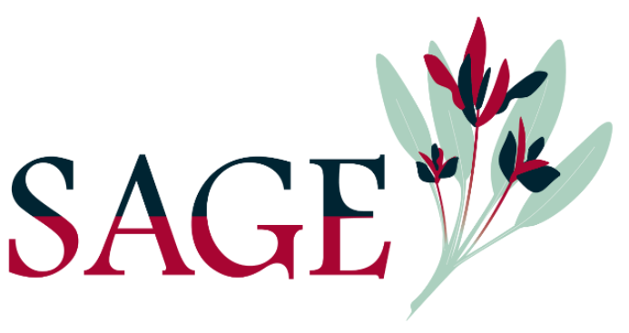

# IDEAL - High School
SAGE Program - activity Job Shadow

This material contains accomplishments about DOE ASCR ECRP project called Image across Domains, Experiments, Algorithms and Learning (IDEAL). This is a compact  version of talk previously shown at <a href="https://github.com/dani-lbnl/wids2020">WiDS'20</a>.

<table border="0">
 <tr>
    <td>
    </td>
    <td>
     

      - Presentation: <a href=SAGE_dani_vision.pdf>[here]</a>
      

      - Video: <a href=schedule.pdf>[here]</a>
       

      - More info about science projects: <a href=https://bit.ly/idealdatascience> [here] </a>
       

      - Get started - python & image processing: <a href=https://datacarpentry.org/image-processing/> [here] </a>
      </td>
 </tr>
</table>

This site: https://bit.ly/machinevisionlbl
